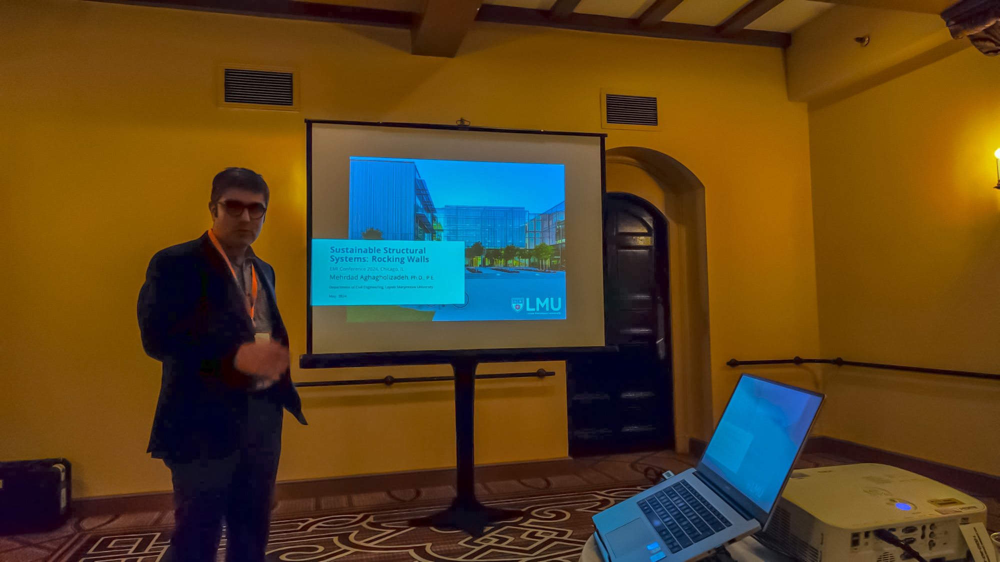
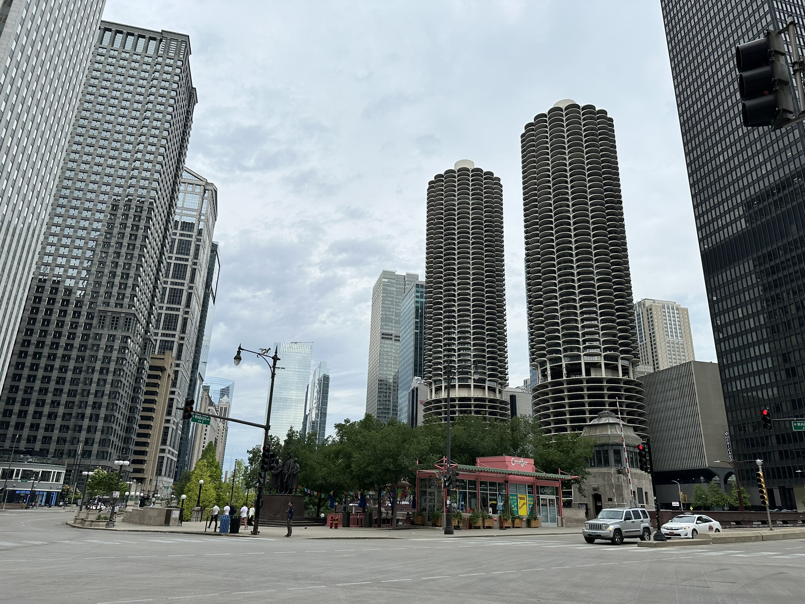
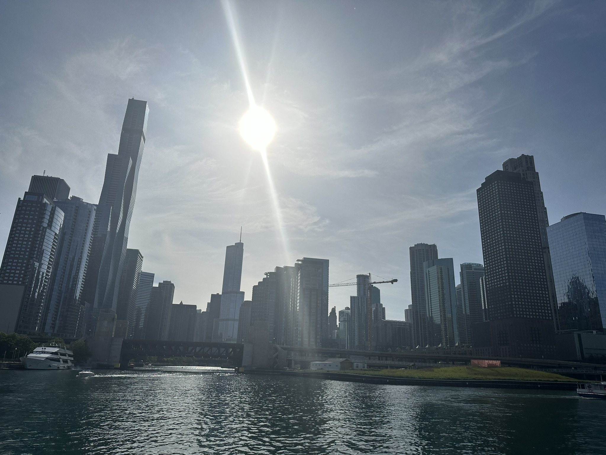

Engineering Mechanics Institute (EMI) of American Society of Civil Engineers (ASCE) conference held in Chicago, IL from May 28-31.

It was a great conference and the sehm lab had a presentation on "Response modification of moment resisting frames using sustainable structural systems: Rocking walls".

<!---->

        

            

            

            

